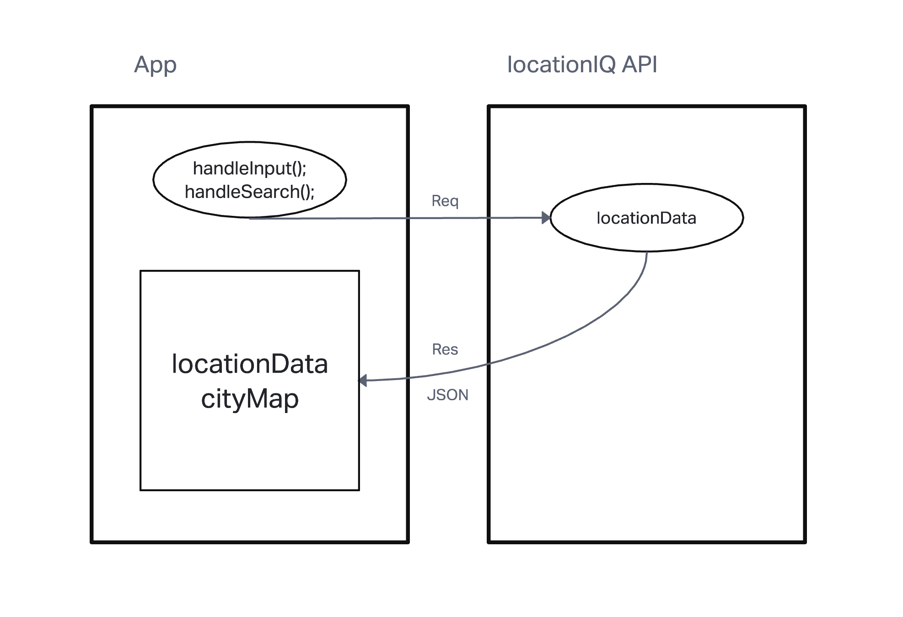
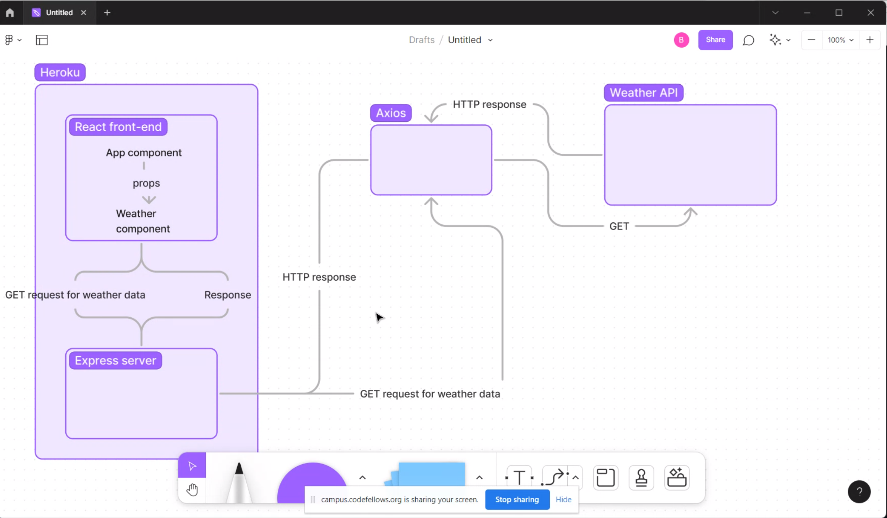

# Project Name - City Explorer

**Author**: Erik Dodd
**Version**: 1.0.0 (increment the patch/fix version number if you make more commits past your first submission)

## Overview
<!-- Provide a high level overview of what this application is and why you are building it, beyond the fact that it's an assignment for this class. (i.e. What's your problem domain?) -->

- We are building an app to help individuals get information on a particular city. It should allow the user to input a particular city and the API will return information regarding the city like longitude, latitude, a map, and other helpful information.

## Getting Started
<!-- What are the steps that a user must take in order to build this app on their own machine and get it running? -->

## Architecture
<!-- Provide a detailed description of the application design. What technologies (languages, libraries, etc) you're using, and any other relevant design information. -->

## Change Log
<!-- Use this area to document the iterative changes made to your application as each feature is successfully implemented. Use time stamps. Here's an example:

01-01-2001 4:59pm - Application now has a fully-functional express server, with a GET route for the location resource. -->

## Credit and Collaborations
<!-- Give credit (and a link) to other people or resources that helped you build this application. -->

Name of feature: Lab06 -

Lab 06 Partner - Dustin Apodaca

Estimate of time needed to complete: 3 hours

Start time: 1:15pm

Finish time: 6:15pm

Attributions:

- Special Thank You to Dustin for helping me with displaying the map and also being my partner for today's lab. He also helped me getting set-up with CSS.

Name of feature: Lab07

Lab 7 Partner - Chris Fanucchi

Estimate of time needed to complete: 3 hours

Start time: 2:00 PM

Finish time: 9:30 PM

Actual time needed to complete: 5.5 hours

Attributions:

Special Thank You to Ben Mills for helping me with lab 07. Rendering the weather data, helping me with the frontend and backend.

Name of feature: Lab08

Partners: Ben Lieberman, Michael Kancov

Estimate of time needed to complete: 3.5 - 4 hours

Start time: 2:30 PM

Finish time: _____

Actual time needed to complete: _____

Special thank you to Tammy Do for helping me debug my backend and solve an issue that was creating a server error.

Special thank you to Ben Mills for helping me rendering the weather data on my front end. Just needed to adjust localhost3000 to 3001 and also adjust something in the weather card.
